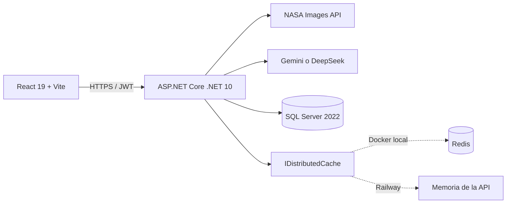

# Cosmara — explorador espacial de la NASA con IA

Aplicación full-stack para descubrir imágenes de la NASA, buscarlas con lenguaje natural, organizarlas en colecciones y enriquecerlas con IA generativa. Cosmara combina una experiencia bilingüe con una API en .NET, búsqueda semántica auditable y persistencia en SQL Server.

[Ver aplicación](https://cosmara.up.railway.app) · [Estado de la API](https://cosmara-api.up.railway.app/health) · [Código fuente](https://github.com/Jeanzb/Cosmara) · [Reportar un problema](https://github.com/Jeanzb/Cosmara/issues)

> El despliegue principal está en Railway y reemplaza al despliegue anterior de Azure. Los enlaces públicos fueron verificados el 29 de agosto de 2026. Después de un periodo sin tráfico, la primera carga puede tardar unos segundos por el arranque en frío.

## Descripción

Cosmara consume la [NASA Image and Video Library](https://images.nasa.gov) y permite explorar su catálogo mediante búsqueda estándar o semántica. La búsqueda pública admite filtros por fecha, misión, rover y cámara. Al iniciar sesión, cada usuario puede crear colecciones privadas, guardar imágenes, añadir notas y etiquetas, generar enriquecimientos con IA, comparar imágenes y exportar una colección a PDF desde la API.

El proyecto se desarrolló como solución al [challenge técnico de MindShore](https://github.com/mindshoresl/challenge), con énfasis en arquitectura mantenible, seguridad por usuario, experiencia accesible y costos operativos bajos.

## Enlaces

| Recurso | Enlace |
| --- | --- |
| Aplicación web | [cosmara.up.railway.app](https://cosmara.up.railway.app) |
| API y liveness check | [cosmara-api.up.railway.app/health](https://cosmara-api.up.railway.app/health) |
| Repositorio | [github.com/Jeanzb/Cosmara](https://github.com/Jeanzb/Cosmara) |
| Issues | [github.com/Jeanzb/Cosmara/issues](https://github.com/Jeanzb/Cosmara/issues) |
| API de imágenes NASA | [images.nasa.gov](https://images.nasa.gov) |

## Funcionalidades

- Búsqueda estándar con paginación y filtros de fecha, misión, rover y cámara.
- Búsqueda semántica en español e inglés, con interpretación visible, filtros inferidos removibles, razones de coincidencia y fallback determinista.
- URL como fuente de verdad para consulta, modo y filtros; admite recarga, navegación atrás y enlaces compartidos.
- Colecciones privadas por usuario, notas por imagen, etiquetas manuales y sugeridas por IA.
- Comparador de dos o más imágenes con análisis generativo estructurado.
- Timeline interactiva para navegar imágenes por fecha de captura.
- Enriquecimiento con descripción, datos destacados y contexto histórico.
- Exportación de colecciones a PDF disponible en el backend.
- Registro, inicio de sesión y renovación de sesión mediante JWT.
- Interfaz responsive, navegación por teclado, estados `aria-live` e internacionalización ES/EN.

La exploración y la telemetría anónima de búsqueda son públicas. Las colecciones, etiquetas, comparaciones, enriquecimientos y exportaciones requieren autenticación.

## Búsqueda semántica

La búsqueda semántica no usa embeddings, una base vectorial ni servicios adicionales. Su flujo está diseñado para ser predecible, auditable y económico:

1. Convierte la consulta en un plan JSON versionado con consulta principal, alternativa, términos y filtros inferidos.
2. Usa temperatura `0`, un máximo de 200 tokens y un timeout semántico de 8 segundos.
3. Ante timeout, error del proveedor o JSON inválido, aplica un normalizador determinista y continúa sin responder `500`.
4. Consulta hasta dos candidatos, con un presupuesto máximo de seis llamadas a NASA, fusiona por `NasaImageId` y elimina resultados que violen filtros.
5. Ordena por cobertura ponderada: título 35 %, keywords 30 %, misión/rover/cámara 20 %, descripción 10 % y posición de NASA 5 %.
6. Cachea el plan durante 24 horas y hasta 200 resultados ordenados durante 15 minutos; las páginas posteriores usan un cursor opaco y no vuelven a llamar al modelo.

`GET /api/search/semantic` conserva el contrato anterior y añade `searchId`, `mode`, `interpretedQuery`, `appliedFilters`, `degraded`, `degradationReason`, `nextCursor` y `relaxationSuggestions`. Cada imagen puede incluir `relevanceScore` y `matchReasons`; la UI presenta las razones sin mostrar la puntuación técnica. Un cursor vencido responde `410 search_session_expired`.

Los filtros explícitos siempre prevalecen sobre los inferidos. Si no existe una coincidencia válida, la API devuelve cero resultados y sugerencias concretas para retirar filtros, sin relajar fechas ni inventar resultados.

## Arquitectura



El backend aplica Clean Architecture y CQRS:

```text
apps/backend/src/
├── NasaExplorer.Domain/          Entidades, modelos e interfaces
├── NasaExplorer.Application/     Casos de uso, validación y DTOs
├── NasaExplorer.Infrastructure/  EF Core, repositorios, NASA, IA y caché
└── NasaExplorer.API/             Controllers, middleware y configuración HTTP
```

El frontend organiza rutas, páginas, componentes, hooks, servicios y tipos por dominio:

```text
apps/frontend/src/
├── components/  UI por funcionalidad y componentes shadcn/ui
├── hooks/       TanStack Query y estado de operaciones remotas
├── pages/       Composición de vistas
├── routes/      TanStack Router
├── services/    Clientes tipados de la API
├── store/       Estado global con Zustand
└── types/       Contratos TypeScript por funcionalidad
```

## Stack tecnológico

| Área | Tecnologías principales |
| --- | --- |
| Frontend | React 19, TypeScript 5.9, Vite 7, Bun, TanStack Router, TanStack Query, Zustand |
| UI | Tailwind CSS, shadcn/ui, React Hook Form, Zod, Sonner, Lucide |
| i18n | Paraglide JS, español e inglés |
| Backend | .NET 10, ASP.NET Core, Clean Architecture, CQRS, MediatR 12, FluentValidation |
| Datos y seguridad | EF Core 10, SQL Server 2022, JWT Bearer, BCrypt, soft delete y aislamiento por usuario |
| Integraciones | NASA Images API y un proveedor compatible con OpenAI: Gemini o DeepSeek |
| Observabilidad | Serilog, health checks, métricas estructuradas y rate limiting por IP |
| Pruebas | xUnit, pruebas de integración y evaluación, Cypress Component y Cypress E2E |
| Infraestructura | Docker Compose, Nginx y Railway |

## Decisiones técnicas

- **Aislamiento por usuario:** los repositorios filtran por `UserId`; un usuario no puede consultar ni modificar colecciones ajenas.
- **Caché desacoplada:** `IDistributedCache` usa Redis en Docker local y memoria en la única réplica de Railway. Una futura escala horizontal requerirá Redis u otra caché compartida.
- **Fallback semántico determinista:** la búsqueda en lenguaje natural sigue funcionando cuando el proveedor no está configurado, no tiene saldo o está temporalmente caído. Los demás endpoints de IA dependen del proveedor cuando existe una clave configurada.
- **Costo controlado:** se mantiene un único proveedor de IA activo, no hay failover que pueda duplicar cobros y la búsqueda impone presupuestos de tokens y llamadas externas.
- **Persistencia automática:** EF Core aplica migraciones y ejecuta un seed idempotente al iniciar la API.
- **Telemetría sin consulta cruda:** se registran modelo, tokens, latencias, cache hit, llamadas a NASA y resultado sin almacenar el texto completo de búsqueda ni claves de caché.
- **Rate limiting:** 30 solicitudes/minuto/IP para búsqueda estándar, 10 para búsqueda semántica, 10 para endpoints de IA y una regla global de 120.

## Getting Started

### Prerequisites

- Docker y Docker Compose instalados.
- Git instalado.
- Para desarrollo sin Docker: .NET SDK 10.0.300 y Bun 1.3 o compatible.

### Setup

1. Clona el repositorio.

   ```bash
   git clone https://github.com/Jeanzb/Cosmara.git
   cd Cosmara
   ```

2. Copia el archivo de entorno.

   ```bash
   cp .env.example .env
   ```

   En PowerShell puedes usar `Copy-Item .env.example .env`.

3. Edita `.env`. Como mínimo, reemplaza `MSSQL_SA_PASSWORD` y `Jwt__Secret` por valores fuertes. `NASA_API_KEY` y `AI_API_KEY` son opcionales para ejecutar la aplicación con sus fallbacks.

4. Inicia todos los servicios.

   ```bash
   docker compose up --build
   ```

5. Abre [http://localhost:8080](http://localhost:8080). La API queda disponible en [http://localhost:5000](http://localhost:5000) y su health check en [http://localhost:5000/health](http://localhost:5000/health).

Puertos predeterminados de Docker Compose:

| Servicio | Puerto | Persistencia local |
| --- | ---: | --- |
| Frontend | `8080` | No aplica |
| API | `5000` | No aplica |
| SQL Server 2022 Developer | `1433` | Volumen `sqlserverdata` |
| Redis | `6379` | Efímera |

### Demo credentials

- Email: `demo@nasaexplorer.com`
- Password: `Demo1234!`

Las credenciales se crean mediante un seed idempotente cuando la base de datos está vacía.

### Desarrollo local

La ejecución directa no carga automáticamente el `.env` raíz. Con SQL Server disponible, configura al menos `ConnectionStrings__Default` y `Jwt__Secret` mediante variables del sistema o .NET User Secrets; Redis es opcional porque la API usa memoria cuando no hay conexión configurada.

```powershell
$env:ConnectionStrings__Default="Server=localhost,1433;Database=NasaExplorer;User Id=sa;Password=<tu-password>;TrustServerCertificate=True"
$env:Jwt__Secret="<secreto-aleatorio-de-al-menos-32-caracteres>"
dotnet run --project apps/backend/src/NasaExplorer.API
```

En otra terminal:

```bash
cd apps/frontend
bun install
bun run dev
```

La API local usa `http://localhost:5207` y Vite sirve el frontend en `http://localhost:5173`; el cliente ya utiliza `5207` como fallback. Si necesitas otra API, crea `apps/frontend/.env.local` con `VITE_API_BASE_URL=<url>`. El documento OpenAPI se expone en `/openapi/v1.json` solo cuando la API se ejecuta en modo `Development`; no se incluye Swagger UI.

## Variables de entorno

| Variable | Uso | Obligatoria |
| --- | --- | --- |
| `MSSQL_SA_PASSWORD` | Contraseña de SQL Server para Docker local | Sí |
| `ConnectionStrings__Default` | Conexión EF Core; Docker Compose la construye automáticamente | En ejecución directa o deploy |
| `Jwt__Secret` | Firma de tokens JWT; usa al menos 32 caracteres aleatorios | Sí |
| `Jwt__Issuer`, `Jwt__Audience` | Emisor y audiencia de los tokens | Sí |
| `NASA_API_BASE_URL` | Base de NASA Images API | No, tiene valor predeterminado |
| `NASA_API_KEY` | Variable reservada; el cliente actual de NASA Images no la envía | No |
| `AI_BASE_URL` | Endpoint compatible con OpenAI | No |
| `AI_MODEL` | Identificador del modelo activo | No |
| `AI_API_KEY` | Credencial del proveedor de IA | No, activa fallback determinista si falta |
| `Redis__ConnectionString` | Redis local o caché compartida opcional | No |
| `CORS_ALLOWED_ORIGINS` | Orígenes permitidos, separados por coma | Sí en deploy |
| `VITE_API_BASE_URL` | Sobrescribe la API usada por Vite; su fallback local es `5207` | No |
| `DOCKER_VITE_API_BASE_URL` | API incorporada al build Docker del frontend | Sí para Docker/deploy |

Los valores incluidos en `.env.example` son exclusivamente de desarrollo. Nunca reutilices esos secretos en un entorno público ni subas `.env` al repositorio.

`VITE_API_BASE_URL` y `DOCKER_VITE_API_BASE_URL` se incorporan al bundle durante el build. Después de cambiarlas, reconstruye el frontend con `docker compose up --build`.

## Proveedor de IA

La clave vive únicamente en el backend. El despliegue actual conserva Gemini 2.5 Flash como proveedor activo:

```dotenv
AI_BASE_URL=https://generativelanguage.googleapis.com/v1beta/openai/
AI_MODEL=gemini-2.5-flash
AI_API_KEY=<tu-clave-de-gemini>
```

Para usar DeepSeek sin cambiar el frontend:

```dotenv
AI_BASE_URL=https://api.deepseek.com/
AI_MODEL=deepseek-v4-flash
AI_API_KEY=<tu-clave-rotada-de-deepseek>
```

El identificador de modelo debe estar habilitado para la cuenta y región del proveedor. Para las transformaciones estructuradas, el cliente deshabilita razonamiento adicional cuando el proveedor lo admite. Si la clave fue compartida en un chat, log o captura, revócala y crea una nueva antes de configurarla en Railway.

## API

| Método y ruta | Descripción | Acceso |
| --- | --- | --- |
| `GET /health` | Estado de la API | Público |
| `POST /api/auth/register` | Registro | Público |
| `POST /api/auth/login` | Inicio de sesión | Público |
| `POST /api/auth/refresh` | Renovación de token | Público |
| `GET /api/search` | Búsqueda estándar y filtros | Público |
| `GET /api/search/semantic` | Búsqueda semántica, locale y cursor | Público |
| `POST /api/search/events` | Telemetría sin texto de consulta | Público |
| `/api/collections` | CRUD de colecciones, imágenes y notas | JWT |
| `POST /api/ai/enrich` | Enriquecimiento de imagen | JWT |
| `POST /api/ai/compare` | Comparación de imágenes | JWT |
| `/api/tags/images/{imageId}` | Añadir, retirar o sugerir etiquetas | JWT |
| `POST /api/exports/collections/{collectionId}/pdf` | Exportar colección a PDF | JWT |

## Pruebas y evaluación

```bash
dotnet test apps/backend/NasaExplorer.sln
dotnet test apps/backend/tests/evaluation/NasaExplorer.Search.Evaluation

cd apps/frontend
bun run typecheck
bun run test
bun run test:e2e
bun run build
```

Para E2E local, ejecuta primero la API en `http://localhost:5207` y `bun run dev` en otra terminal. Los tests no levantan esos procesos automáticamente y algunos flujos crean y eliminan colecciones reales del usuario demo.

Última validación completa registrada:

- 149 pruebas backend: 98 de Application, 44 de Infrastructure y 7 de integración API.
- 7 pruebas del benchmark semántico.
- 25 pruebas Cypress Component.
- 15 pruebas Cypress E2E en local y las mismas 15 contra producción.
- Typecheck y builds de frontend/backend correctos.

El benchmark congelado contiene 48 consultas —24 ES y 24 EN— con relevancia 0–3 y cubre conceptos visuales, misión/instrumento, fechas, ambigüedad, errores tipográficos y cero resultados.

| Estrategia | nDCG@10 |
| --- | ---: |
| Búsqueda estándar | 0.4873 |
| Semántica anterior | 0.6918 |
| Semántica actual | 0.9859 |

La implementación actual mejora 42.5 % respecto a la semántica anterior en este benchmark, con cero violaciones de filtros, cero IDs duplicados entre páginas y consistencia de páginas igual a 1. Es una evaluación offline reproducible sobre un corpus sintético versionado; no representa tráfico vivo de NASA ni una evaluación online del proveedor de IA.

## Despliegue en Railway

La infraestructura productiva conserva tres servicios. Esta configuración vive actualmente en Railway y no está declarada como IaC dentro del repositorio:

- **Frontend:** build de React/Vite servido por Nginx en [cosmara.up.railway.app](https://cosmara.up.railway.app).
- **API:** contenedor ASP.NET Core con base `https://cosmara-api.up.railway.app`; su [liveness check](https://cosmara-api.up.railway.app/health) está en `/health`. La raíz no define una ruta pública, por lo que responde `404` de forma esperada.
- **Base de datos:** SQL Server 2022 Express desplegado desde una plantilla comunitaria, con volumen persistente en `/var/opt/mssql`. Docker Compose usa la edición Developer únicamente para desarrollo local.

Para minimizar costos, no existe un servicio Redis separado en Railway: la única réplica de la API usa caché en memoria. Frontend y API pueden suspender cómputo durante inactividad; SQL Server permanece disponible porque mantiene el volumen persistente. Si la aplicación deja de necesitar acceso continuo, la base puede suspenderse manualmente según las opciones de la plantilla.

Los secretos (`Jwt__Secret`, `NASA_API_KEY`, `AI_API_KEY` y credenciales SQL) se inyectan como variables de Railway y no se almacenan en Git. `AI_BASE_URL` y `AI_MODEL` permiten cambiar entre Gemini y DeepSeek sin reconstruir el frontend.

## Seguridad y limitaciones conocidas

- Las contraseñas se almacenan con BCrypt y los endpoints privados usan JWT Bearer.
- La validación se ejecuta con FluentValidation y los errores internos no exponen stack traces.
- `/health` es un liveness check del proceso; no comprueba SQL Server, NASA, Redis ni el proveedor de IA.
- El seed demo se ejecuta al iniciar una base vacía fuera del entorno `Testing`. Es apropiado para esta demostración pública, pero debe deshabilitarse o cambiar sus credenciales antes de almacenar datos sensibles.
- El JWT del frontend se persiste actualmente en `localStorage`; para un producto público de mayor riesgo conviene migrarlo a cookies `HttpOnly`, `Secure` y `SameSite` con protección CSRF.
- La caché semántica en memoria presupone una sola réplica de API. Antes de escalar horizontalmente debe habilitarse una caché compartida.
- El servicio y el hook de exportación PDF ya existen, pero todavía falta invocarlos desde un componente y completar la descarga en la interfaz.
- La recuperación de contraseña por correo y la paginación de colecciones grandes quedan como trabajo futuro.
- El repositorio no incluye todavía un archivo `LICENSE`; revísalo antes de reutilizar o redistribuir el código.

## Estado del repositorio

El repositorio público vive en [Jeanzb/Cosmara](https://github.com/Jeanzb/Cosmara). Esta versión documenta la migración de Azure a Railway, el dominio público de Cosmara, SQL Server persistente, la integración configurable con DeepSeek y la nueva búsqueda semántica end-to-end.
